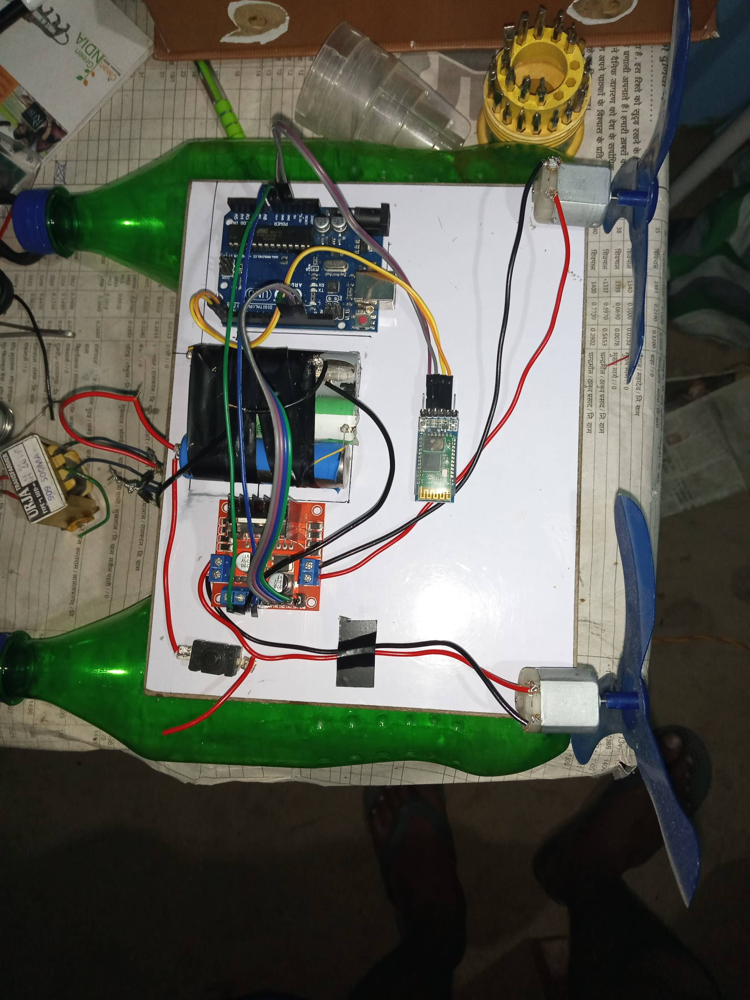

# Arduino-Based Bluetooth-Controlled Rover 🚗📱

## 🔧 Project Overview

This is a Bluetooth-controlled rover developed as part of my diploma project using Arduino. The aim was to create a simple and affordable mobile robot that can be controlled wirelessly using a smartphone.

## 🛠️ Features

- 🤖 **Arduino UNO**: Acts as the brain of the rover.
- 🔋 **12V Battery**: Powers the entire system.
- 📶 **Bluetooth Module (HC-05)**: Enables wireless control via a smartphone app.
- ⚙️ **Gear Motors with Wheels**: Provides motion and direction to the rover.
- 🔦 **LED Lights**: Indicators or headlights for visibility and effect.
- 📢 **Buzzer**: Audible alerts for various functions.
- 🔘 **Push Button**: For manual start/stop or reset.
- 🔌 **L298N Motor Driver Module**: Controls the direction and speed of the gear motors.

## 📲 How it Works

1. Connect the rover to a smartphone via Bluetooth using any serial terminal app.
2. Send commands to move the rover forward, backward, left, or right.
3. LEDs and buzzer provide visual and sound feedback based on actions.
4. Button can be used for emergency stop or to toggle a feature.

## 🖼️ Project Image

The actual rover built for this project is shown above. All wiring is done manually on a chassis board, with components securely attached using tape and screws.

---

# Arduino-Based Bluetooth-Controlled RC Boat 🚤📱

## 🔧 Project Overview

This is a Bluetooth-controlled RC boat created as a part of my diploma project using Arduino. It is designed to float and navigate on water using thrust generated by motor-driven propellers. Control is achieved wirelessly via a smartphone using Bluetooth.

## 🛠️ Features

- 🤖 **Arduino UNO**: Core controller for handling input and output.
- 🔋 **12V Battery**: Main power supply for the components.
- 📶 **Bluetooth Module (HC-05)**: Connects to a mobile phone for wireless commands.
- 🛶 **Plastic Bottles**: Used in place of wheels to provide buoyancy and keep the boat afloat.
- ⚙️ **DC Motors with Propellers**: Generates thrust to move and steer the boat.
- 🔦 **LED Lights**: Used for visibility and status indication.
- 📢 **Buzzer**: Provides audible feedback on actions or alerts.
- 🔘 **Push Button**: Can be used for manual control like reset or stop.
- 🔌 **L298N Motor Driver Module**: Drives the motors and controls their speed/direction.

## 🌊 How it Works

1. The boat floats on water with the help of plastic bottles attached beneath it.
2. When powered on and connected via Bluetooth, commands from a mobile app control the motors.
3. The two DC motors with propellers generate forward and turning thrust.
4. LEDs and buzzer act as indicators for feedback.
5. Simple push-button can be used to reset or toggle a function manually.

## 🖼️ Project Image

The image above shows the complete boat with its mounted components and wiring. The build focuses on simplicity, functionality, and DIY principles using commonly available materials.

---

# Laser Security Alarm System 🔒🔦

## 🔧 Project Overview

This Laser Security Alarm System is a simple yet effective intrusion detection system built as part of my diploma project using Arduino Nano. It uses a laser and an LDR (Light Dependent Resistor) to detect any break in the laser beam and triggers a buzzer alarm.

## 🛠️ Features

- 🧠 **Arduino Nano**: Acts as the control unit, monitoring the sensor input.
- 🔦 **Laser Module**: Projects a laser beam toward the LDR sensor.
- 📉 **LDR Sensor**: Detects the laser beam; any obstruction triggers an alarm.
- 🔊 **Buzzer**: Activates when the laser beam is broken, alerting to a breach.
- 🔌 **USB Power Supply**: Powers the Arduino Nano and connected modules.

## 🚨 How it Works

1. The **laser module** is continuously pointed at the **LDR sensor**.
2. The **Arduino Nano** constantly reads the LDR values.
3. If the laser beam is interrupted (e.g., by an intruder), the light intensity drops.
4. When a significant drop is detected, the **buzzer** is triggered to sound the alarm.
5. The system automatically resets once the laser beam is restored.

## 📸 Project Image

The image above shows the setup with clearly labeled components mounted on a board. This project is ideal for demonstrating basic security systems and sensor-based automation.

---

# Mini Portable Rechargeable Inverter ⚡🔋

## 🔧 Project Overview

This Mini Portable Rechargeable Inverter is a compact, lightweight, and multipurpose power solution ideal for emergency or travel use. It’s designed to power household devices such as CFL bulbs and USB-powered electronics, providing reliable energy from a 12V battery source.

## 🛠️ Features

- 🔌 **Light Holder**: Supports CFL/LED bulb usage during power cuts.
- 🔋 **Rechargeable 12V Battery**: Built-in power source with up to 5 hours of backup.
- 🔄 **AC to DC Converter**: Converts 220V AC to 12V DC to charge the battery.
- 🔌 **Power Socket**: Standard output socket for plugging in USB chargers or other 12V appliances.
- 🔋 **Built-in Battery Charger**: Automatically charges the internal battery when connected to the main supply.
- 💡 **Portable Design**: Compact and easy to carry for use in rural areas or emergency situations.

## ⚙️ How It Works

1. The inverter uses a **12V DC battery** that powers connected appliances.
2. It includes a **charging circuit** that recharges the battery from AC mains using a built-in **AC to DC converter**.
3. Devices like bulbs (via holder) and USB lights/chargers (via socket) can run simultaneously.
4. Once fully charged, the inverter provides **backup for up to 5 hours**, depending on the load.

## 📸 Project Image

The image above shows a working setup with a connected CFL bulb and a USB LED light, all powered by the mini inverter unit.
An ideal DIY solution for students, rural households, and tech enthusiasts looking to create low-cost, backup power systems. 🌟🔌
---

## 📬 Contact

Feel free to reach out if you have any questions or feedback:

---
